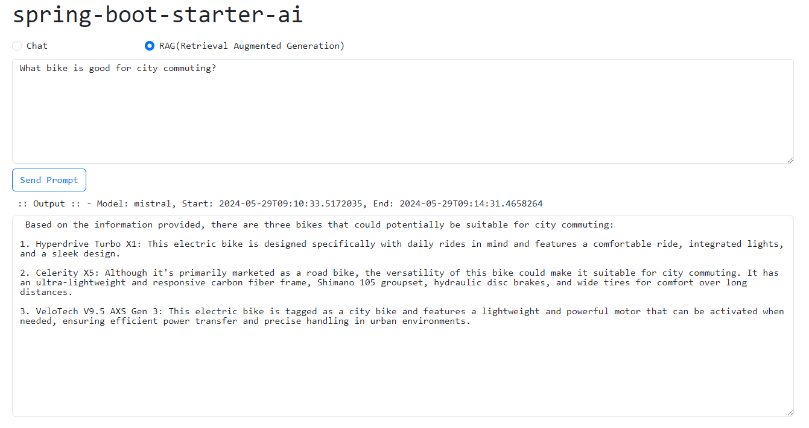

# spring-boot-starter-ai

Spring Boot starter for AI with Ollama for simple chat as well as RAG.

## Requirements

- [Java 21](https://www.oracle.com/pk/java/technologies/downloads/#java21)
- [Maven 3](https://maven.apache.org)
- [Ollama](https://ollama.com/download)

## Running the application locally

- Run Ollama with 'mistral' LLM model in command window `ollama run mistral`

- Execute the `main` method of `io.github.meritepk.webapp.Application` class from IDE

or

- Use [Spring Boot Maven plugin](https://docs.spring.io/spring-boot/docs/current/reference/html/build-tool-plugins-maven-plugin.html) like `mvn spring-boot:run`

Open [http://localhost:8080/webapp/ui/index.html](http://localhost:8080/webapp/ui/index.html) in web browser
